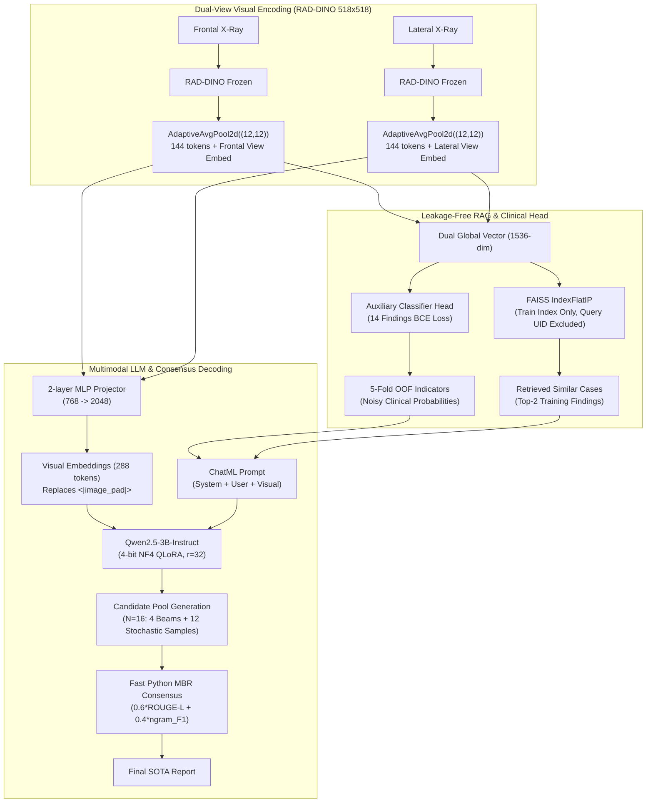

# Dual-View RAG-VLM: IU X-Ray Report Generation

A multimodal radiograph report generation pipeline designed to beat published state-of-the-art benchmarks on the Indiana University Chest X-Ray (IU X-Ray) dataset under strict, leakage-free empirical protocols.

---

## 1. Benchmark Targets to Beat

| Model / Paper | Venue / Year | BLEU-1 | BLEU-4 | METEOR | ROUGE-L | Status |
|:---|:---:|:---:|:---:|:---:|:---:|:---:|
| **DART / DATR** | CVPR 2025 | 0.486 | 0.208 | 0.205 | **0.411** | Primary Target 1 |
| **LePaX** | ECCV 2026 | **0.531** | **0.235** | **0.316** | 0.402 | Primary Target 2 |
| **MPDRL** | Frontiers 2026 | 0.508 | 0.185 | 0.231 | 0.383 | Baseline |
| **DAMPER** | AAAI 2025 | 0.520 | 0.225 | 0.284 | 0.397 | Baseline |
| **KiUT** | CVPR 2023 | 0.525 | 0.185 | 0.242 | 0.409 | Baseline |

---

## 2. Empirical Baseline Hurdle Floors (Test Set, N=589)

Measured and locked using official `pycocoevalcap` (Java 1.8 + Stanford PTBTokenizer):

| ID | Description | BLEU-1 | BLEU-4 | METEOR | ROUGE-L | CIDEr |
|:---|:---|:---:|:---:|:---:|:---:|:---:|
| **E0** | Constant Normal Baseline | 0.2390 | 0.0603 | 0.1455 | 0.2809 | 0.1855 |
| **E1** | Pure Retrieval (Top-1 Train Copy) | 0.3449 | 0.0871 | 0.1514 | 0.2513 | 0.1970 |
| **Probe** | 14-Finding RAD-DINO Linear Probe | — | — | — | — | **Macro-AUC = 0.8135** |

*Key finding*: Frozen `microsoft/rad-dino` visual representations achieve **0.967 AUC on Pleural Effusion**, **0.941 AUC on Pneumonia**, and **0.894 AUC on Cardiomegaly**.

---

## 3. Architecture



---

## 4. Running on Google Colab GPU (1-Click)

The notebook `notebooks/colab_runner.ipynb` is ready for 1-click execution on Google Colab (T4 / L4 / A100 GPU).

### Option A: Via Google Drive (Fastest)
1. Copy or upload this repository folder (`capstone/`) to your Google Drive under `MyDrive/capstone`.
2. Open `notebooks/colab_runner.ipynb` in Google Colab.
3. Select **Runtime -> Change runtime type -> T4 GPU** (or L4 / A100).
4. Run the notebook cells:
   - Mounts Google Drive (`/content/drive/MyDrive/capstone`).
   - Automatically detects the pre-computed `processed/feats/` (all 2,943 studies already cached!).
   - Runs Stage 1 Warmup + Stage 2 QLoRA SFT training.
   - Generates reports and scores with official `pycocoevalcap`.

### Option B: Via GitHub
1. Push your repository to GitHub:
   ```bash
   git remote add origin https://github.com/<YOUR_USERNAME>/capstone.git
   git push -u origin master
   ```
2. In Colab, clone the repository:
   ```bash
   !git clone https://github.com/<YOUR_USERNAME>/capstone.git /content/capstone
   %cd /content/capstone
   ```
3. Run the cells in `notebooks/colab_runner.ipynb`.

---

## 5. Local Execution Commands

```bash
# 1. Prepare data (R2Gen dual-view protocol & word-preserving regex)
python src/prepare_data.py --data_dir data --out_dir processed

# 2. Evaluate normal report baseline (E0 floor)
python src/evaluate.py --mode normal --ref processed/test.json

# 3. Cache visual features & build train FAISS index (E1 hurdle)
python src/cache_features.py --batch_size 16 --encoder microsoft/rad-dino

# 4. Train Dual-View RAG-VLM (Stage 1 Warmup + Stage 2 SFT)
python src/train_sft.py --stage 0 --batch_size 4 --grad_accum 4 --epochs_s1 3 --epochs_s2 10

# 5. Fast MBR consensus generation & official pycocoevalcap scoring
python src/generate_mbr.py --checkpoint_dir outputs/checkpoints/stage2_best --mode mbr --n_candidates 16
```

---

## 6. Repository Structure

```
capstone/
├── commit1.txt                 # Detailed execution manifest and progress log
├── plan.md & plan2.md          # Architectural specifications & ablation matrices
├── README.md                   # Project overview & running instructions
├── requirements.txt            # Python dependencies
├── notebooks/
│   └── colab_runner.ipynb      # 1-click Google Colab runner
├── src/
│   ├── prepare_data.py         # Dual-view study filtering & text cleaner
│   ├── evaluate.py             # Official pycocoevalcap scorer & fast MBR utility
│   ├── cache_features.py       # RAD-DINO pooling, FAISS indexer, probe training
│   ├── dataset.py              # PyTorch Dataset, leakage guard, ChatML prompt
│   ├── model.py                # DualViewRAGVLM, MLP projector, classifier head, QLoRA
│   ├── train_sft.py            # Two-stage training pipeline (warmup + SFT)
│   ├── generate_mbr.py         # MBR consensus decoding & official scoring
│   └── create_colab_notebook.py
├── data/
│   ├── indiana_projections.csv # View projection mappings (Frontal / Lateral)
│   └── indiana_reports.csv     # Study reports & pathology findings
├── processed/
│   ├── splits.json             # Locked split IDs (2060 / 294 / 589)
│   ├── train_faiss.index       # 1,536-dim train retrieval index
│   ├── train_oof_priors.json   # 5-fold OOF clinical prior probabilities
│   └── *.json                  # Datasets and labels
└── outputs/
    ├── normal_baseline.json    # E0 baseline results
    ├── e1_retrieval_baseline.json # E1 baseline results
    └── linear_probe_auc.json   # 14-finding Macro-AUC report
```
